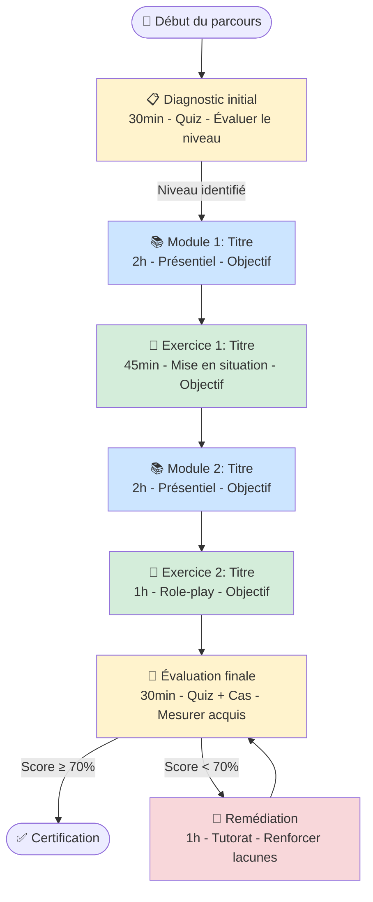
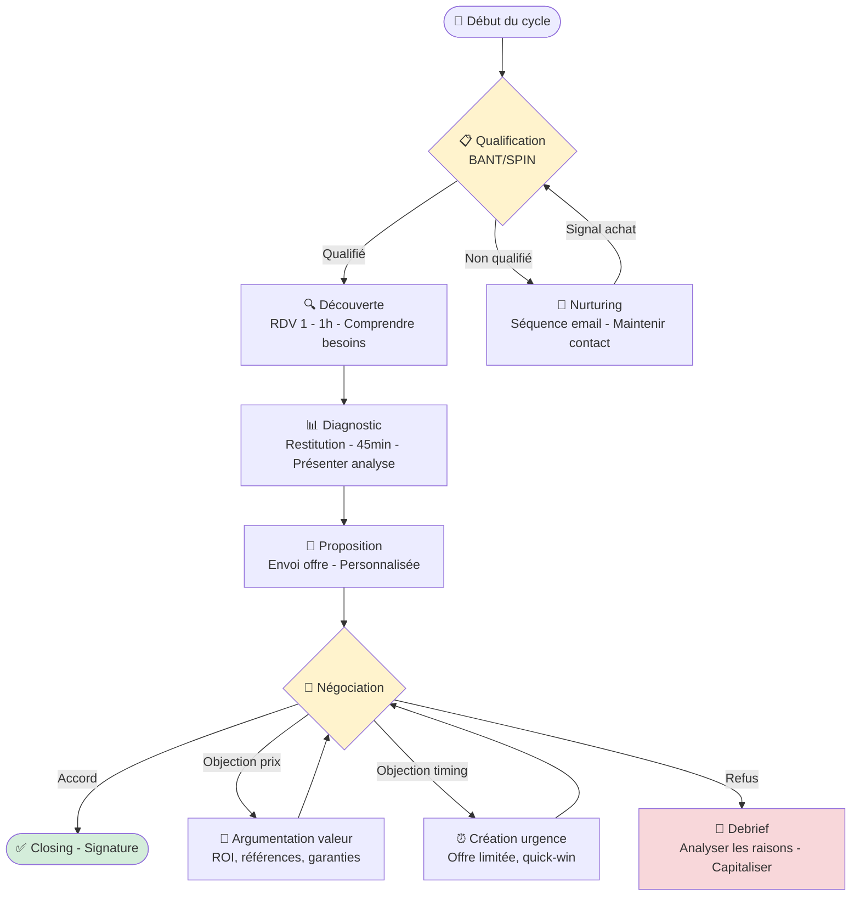
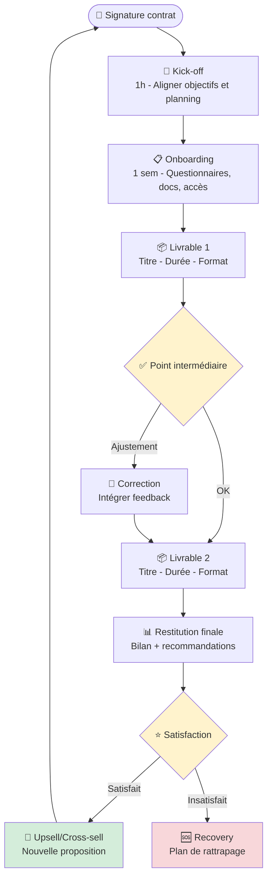
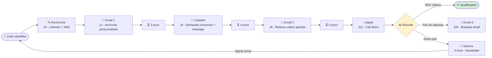
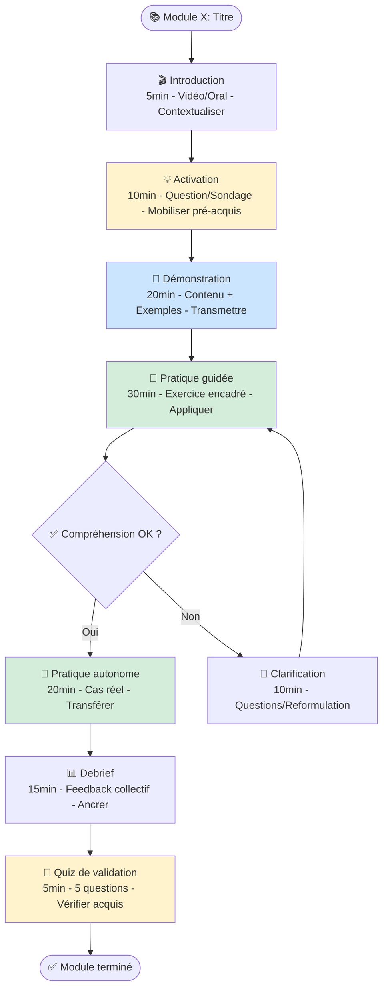

# Templates de Diagrammes — Philippe Grandval

## Règles Générales

- Chaque nœud contient : ID, nom, durée, format, objectif
- Les arêtes portent les conditions de transition
- Les couleurs codent le type : 🟦 contenu / 🟩 exercice / 🟨 évaluation / 🟥 décision
- Toujours inclure un nœud START et un nœud END
- Maximum 15 nœuds par diagramme (sinon découper en sous-diagrammes)

---

## 1. Parcours Apprenant (Bootcamp / Formation)



### Structure JSON associée

```json
{
  "type": "parcours_apprenant",
  "titre": "",
  "audience": "",
  "duree_totale": "",
  "nodes": [
    {
      "id": "M1",
      "type": "module|exercice|evaluation|remediation",
      "titre": "",
      "duree": "",
      "format": "presentiel|elearning|mixte|async",
      "objectif_pedagogique": "",
      "methode": "",
      "prerequis": []
    }
  ],
  "edges": [
    {
      "from": "M1",
      "to": "EX1",
      "condition": "",
      "label": ""
    }
  ]
}
```

---

## 2. Processus de Vente



---

## 3. Parcours Client (Onboarding → Fidélisation)



---

## 4. Séquence de Prospection



---

## 5. Architecture de Module (Zoom)

Pour détailler un seul bloc du parcours apprenant :



---

## Convention de Nommage

| Préfixe | Type de nœud | Couleur |
|---|---|---|
| M | Module / Contenu | 🟦 #CCE5FF |
| EX | Exercice / Mise en situation | 🟩 #D4EDDA |
| EVAL / QUIZ | Évaluation | 🟨 #FFF3CD |
| REMED / ADJUST | Correction / Remédiation | 🟥 #F8D7DA |
| DECISION | Point de décision (losange) | 🟨 #FFF3CD |

## Règles de Philippe

1. **Un diagramme = un niveau de zoom.** Ne pas mélanger vue macro et détail.
2. **Maximum 15 nœuds.** Au-delà, découper en sous-diagrammes liés.
3. **Chaque nœud a 4 infos :** titre, durée, format, objectif.
4. **Chaque arête conditionnelle est explicite.** Pas de "puis" vague.
5. **Toujours proposer le JSON structuré en plus du Mermaid** pour traçabilité.
